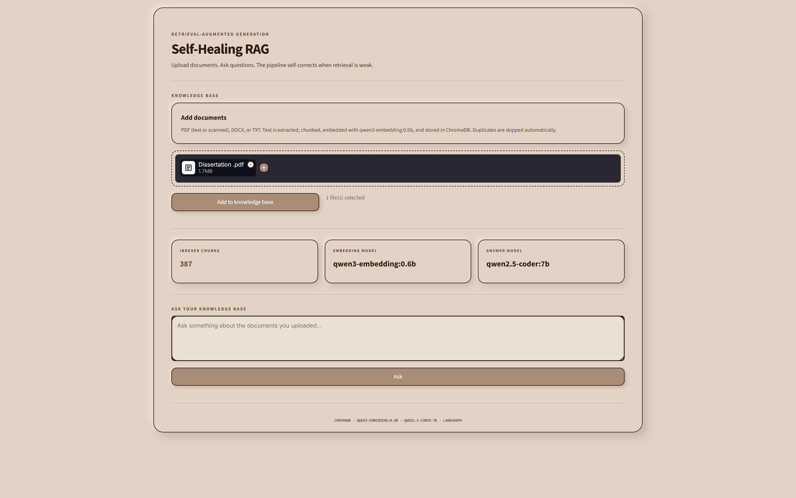
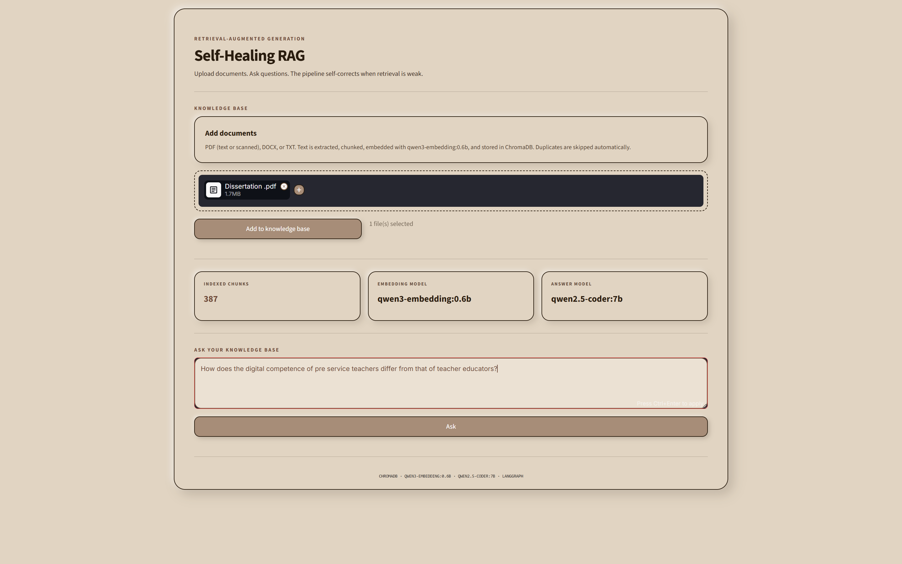
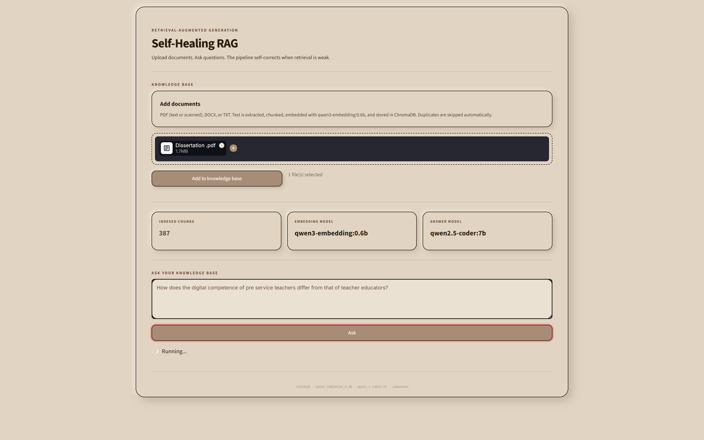
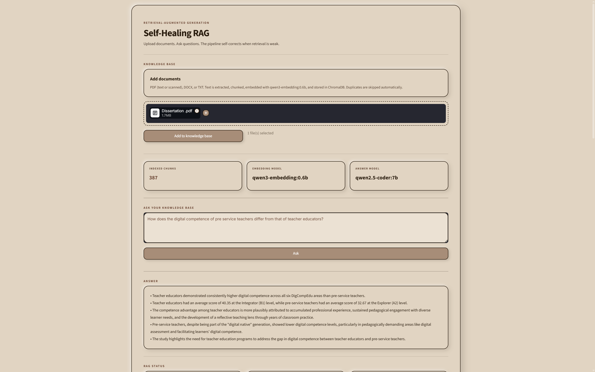
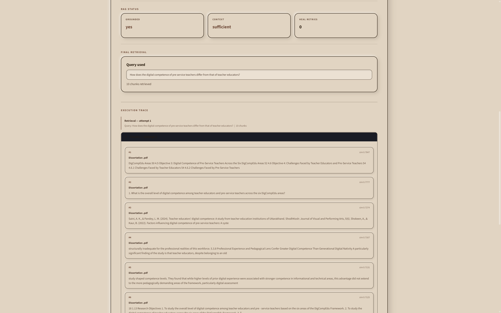
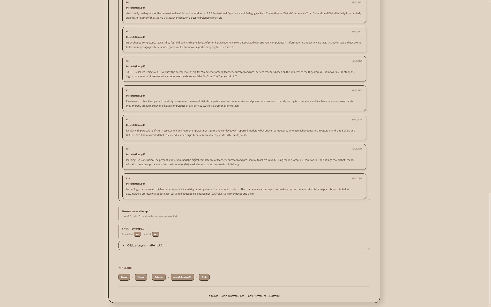
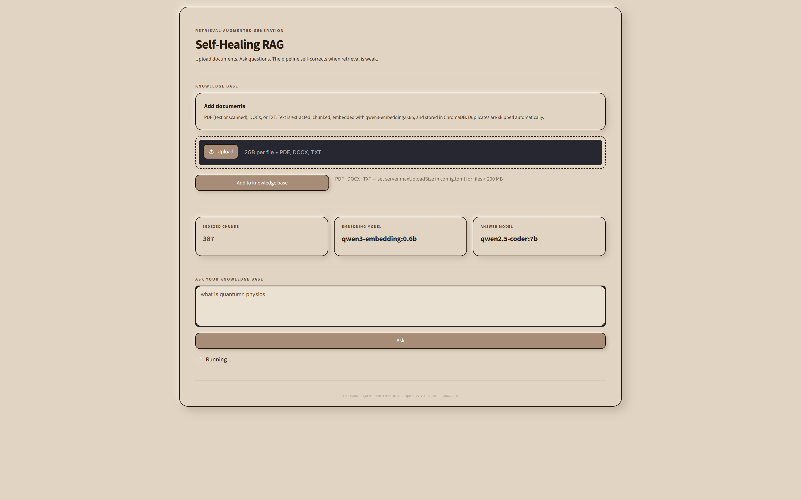
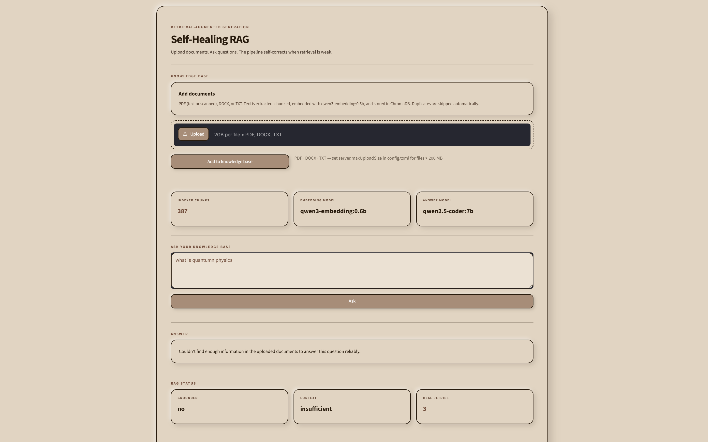
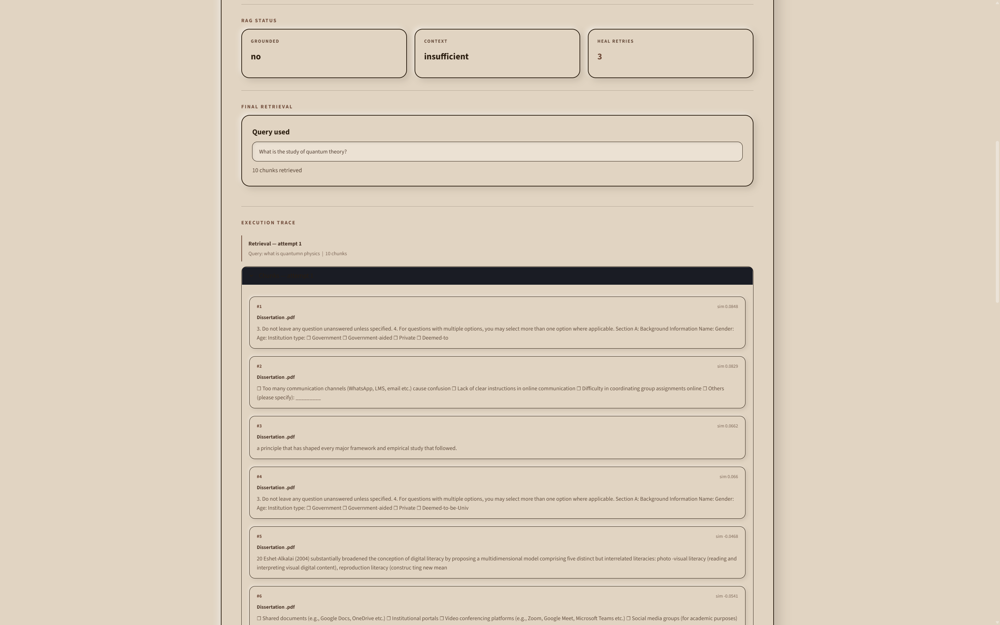
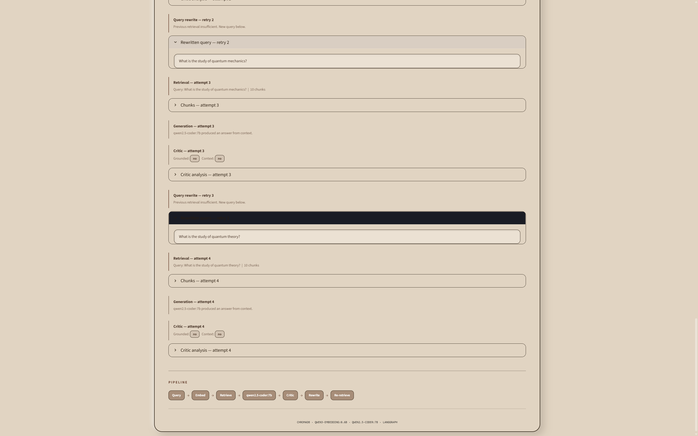

# 🧠 Self-Healing RAG

> **A local Retrieval-Augmented Generation (RAG) system that retrieves information from uploaded documents, evaluates whether the retrieved context is sufficient, and automatically rewrites and retries weak retrievals.**

Self-Healing RAG is designed to reduce hallucinations by making the retrieval pipeline **feedback-driven** instead of simply retrieving documents and asking an LLM to answer.

The application runs locally and uses **Ollama**, allowing the embedding and answer models to run on the user's own machine.

---

## ✨ Features

- 📄 Upload **PDF, DOCX, and TXT** documents
- 🔎 Semantic document retrieval
- 🧩 Automatic document chunking
- 🧠 Local embeddings with `qwen3-embedding:0.6b`
- 🤖 Local answer generation with `qwen2.5-coder:7b`
- 🗃️ Persistent vector storage with **ChromaDB**
- 🔄 **Self-healing retrieval** when retrieved context is insufficient
- 🧪 Critic/grounding stage for answer validation
- 📝 Query rewriting for failed retrieval attempts
- 🔁 Re-retrieval after query rewriting
- 🛑 Rejects questions that cannot be reliably answered from the uploaded knowledge base
- 📊 Displays retrieval results, similarity scores, execution trace, grounding status, and retry count
- 🖥️ Local-first architecture using Ollama

---

## 🏗️ System Architecture

```text
                         ┌──────────────────┐
                         │    User Query    │
                         └────────┬─────────┘
                                  │
                                  ▼
                    ┌─────────────────────────┐
                    │      Query Processing   │
                    └────────────┬────────────┘
                                 │
                                 ▼
                    ┌─────────────────────────┐
                    │     ChromaDB Retrieval  │
                    │    Top-K Relevant Chunks│
                    └────────────┬────────────┘
                                 │
                                 ▼
                    ┌─────────────────────────┐
                    │       Generate Answer   │
                    │     Qwen2.5-Coder:7B    │
                    └────────────┬────────────┘
                                 │
                                 ▼
                    ┌─────────────────────────┐
                    │     Critic / Grounding  │
                    │   Is context sufficient?│
                    └────────────┬────────────┘
                                 │
                    ┌────────────┴─────────────┐
                    │                          │
                  YES                         NO
                    │                          │
                    ▼                          ▼
             ┌─────────────┐        ┌──────────────────┐
             │ Final Answer │        │ Rewrite the Query│
             └─────────────┘        └────────┬─────────┘
                                             │
                                             ▼
                                  ┌────────────────────┐
                                  │ Retrieve Again     │
                                  └─────────┬──────────┘
                                            │
                                            └──────► Critic
```

---

## 🔄 Complete RAG Pipeline

### 1. Document Upload

The user uploads PDF, DOCX, or TXT files. For PDFs, the system first attempts normal text extraction. OCR is used automatically when a page does not contain an extractable text layer.

```text
Document
   │
   ├── PDF ──► Text extraction ──► OCR if required
   │
   ├── DOCX ──► Text extraction
   │
   └── TXT ──► Text extraction
```

### 2. Text Chunking

Extracted text is divided into smaller chunks before embedding.

```text
Chunk size     : 900
Chunk overlap  : 100
```

This allows the retriever to search smaller semantic units instead of sending an entire document to the LLM. A 124-page PDF becomes 387 indexed chunks.

### 3. Embedding

Each chunk is converted into a vector representation using `qwen3-embedding:0.6b` via **Ollama**, locally.

### 4. Vector Database

Vectors are stored in **ChromaDB** for persistent local storage and similarity-based retrieval. Duplicate chunks are skipped using deterministic document IDs.

### 5. Retrieval

The user's question is converted into a semantic search query and the most relevant chunks are retrieved from ChromaDB, along with similarity scores visible in the execution trace.

### 6. Answer Generation

Retrieved context is passed to `qwen2.5-coder:7b`, instructed to answer using retrieved evidence rather than freely relying on external knowledge.

### 7. Critic / Grounding Stage

The generated answer is evaluated for:
- Whether the retrieved context is sufficient
- Whether the answer is supported by the retrieved evidence
- Whether the question is relevant to the available knowledge base

The UI exposes the result as:

```
GROUNDED     →  yes / no
CONTEXT      →  sufficient / insufficient
HEAL RETRIES →  0 / 1 / 2 / 3
```

### 8. Self-Healing Retrieval

If retrieval is weak, the system does **not** simply accept the generated answer. Instead:

```text
Weak Retrieval
      ↓
Critic detects insufficient context
      ↓
Rewrite Query
      ↓
Retrieve again
      ↓
Generate again
      ↓
Critic again
```

### 9. Out-of-Context Question Handling

When the knowledge base doesn't contain enough information, the system explicitly refuses to answer rather than hallucinating. For example, asking `"what is quantum physics"` against a dissertation about digital competence returns:

```
Couldn't find enough information in the uploaded documents to answer this question reliably.
```

---

## 📸 Screenshots

### Main Interface — Upload & Ask

Upload documents and query your knowledge base from a single clean view. Stats for indexed chunks, embedding model, and answer model are shown at a glance.



---

### Document Selected for Upload

A file is picked and ready to be added to the knowledge base before indexing begins.



---

### Query Running

The pipeline spins up as the question is submitted — retrieval, generation, and critic stages are executing.



---

### Grounded Answer — Relevant Question

A well-grounded answer produced from retrieved evidence. The answer is structured and directly drawn from the dissertation content.



---

### RAG Status — Grounded & Sufficient

The system confirms `Grounded: yes`, `Context: sufficient`, and `Heal Retries: 0` — a clean first-pass retrieval.



---

### Retrieved Chunks with Similarity Scores

The execution trace shows every retrieved chunk, its source document, and cosine similarity score. Here 10 chunks from `Dissertation.pdf` are shown, with scores ranging from 0.78 to 0.69.



---

### Self-Healing in Action — Query Rewrites

When context is insufficient, the pipeline rewrites the query and retries retrieval. This trace shows the rewritten queries across multiple attempts (e.g. `"What is the study of quantum theory?"` → `"What is the study of quantum mechanics?"`).



---

### Out-of-Context Question — Graceful Refusal

Asking `"what is quantum physics"` against a dissertation on digital competence triggers a graceful refusal: `Grounded: no`, `Context: insufficient`, `Heal Retries: 3`.



---

### Execution Trace — Out-of-Context Retrieval Detail

The trace shows all attempted chunks for the off-topic question, each with very low similarity scores (0.08–0.06), confirming the knowledge base correctly cannot answer it.



---

### Pipeline Visualization

The full pipeline path is shown at the bottom of every result — `Query → Embed → Retrieve → qwen2.5-coder:7b → Critic → Rewrite → Re-retrieve` — making the flow fully transparent.



---

## 🧰 Tech Stack

| Layer | Technology |
|---|---|
| Language | Python |
| UI | Streamlit |
| LLM Runtime | Ollama |
| Answer Model | Qwen2.5-Coder 7B |
| Embedding Model | Qwen3 Embedding 0.6B |
| Vector Database | ChromaDB |
| RAG Orchestration | LangGraph |
| RAG Framework | LangChain |
| PDF Processing | PyPDF |
| DOCX Processing | python-docx |
| OCR | Tesseract + pdf2image |
| Text Chunking | RecursiveCharacterTextSplitter |
| Local Inference | Ollama |
| Storage | Local persistent ChromaDB |

---

## 🧩 Core Components

```text
project/
│
├── app.py          — Streamlit UI
├── rag.py          — Context building & answer generation
├── graph.py        — LangGraph self-healing workflow
├── loader.py       — Document loading & OCR fallback
├── vectorstore.py  — Embedding, storage & retrieval
├── chroma_db/      — Persistent vector store
└── assets/         — Screenshots
```

---

## 🖥️ Local AI Architecture

```text
                 YOUR LAPTOP
┌───────────────────────────────────────────┐
│                                           │
│  Streamlit UI                             │
│       │                                   │
│       ▼                                   │
│  LangGraph RAG Pipeline                   │
│       │                                   │
│       ├───────────────┐                   │
│       ▼               ▼                   │
│   ChromaDB         Ollama                 │
│                       │                   │
│                 ┌─────┴─────┐             │
│                 ▼           ▼             │
│          Qwen3 Embed   Qwen2.5-Coder      │
│             0.6B            7B            │
│                                           │
└───────────────────────────────────────────┘
```

No external LLM API is required for the core inference pipeline.

---

## 🚀 Installation

### 1. Clone the repository

```bash
git clone https://github.com/YOUR_USERNAME/self-healing-rag.git
cd self-healing-rag
```

### 2. Create a virtual environment

```powershell
# Windows
python -m venv venv
venv\Scripts\activate
```

### 3. Install Python dependencies

```bash
pip install -r requirements.txt
```

Or install manually:

```bash
pip install streamlit langchain langchain-community langchain-ollama \
            langchain-chroma langchain-text-splitters langgraph chromadb \
            pypdf python-docx pytesseract pdf2image
```

---

## 🦙 Ollama Setup

```bash
ollama pull qwen3-embedding:0.6b
ollama pull qwen2.5-coder:7b
ollama serve
```

> If Ollama is already running as a background service, skip `ollama serve` — a second process on port `11434` will conflict.

Verify models are available:

```bash
ollama list
```

---

## ▶️ Run the Application

```bash
streamlit run app.py
```

Then open the local Streamlit URL shown in the terminal.

---

## 📁 Supported Documents

| Format | Supported |
|---|---|
| PDF (text-based) | ✅ |
| PDF (scanned) | ✅ OCR via Tesseract |
| DOCX | ✅ |
| TXT | ✅ |

---

## 🎯 Project Goals

1. **Retrieval validation** — don't blindly trust the first retrieval
2. **Answer grounding** — verify the answer is supported by evidence
3. **Automatic query rewriting** — recover from poor initial queries
4. **Iterative re-retrieval** — up to 3 healing attempts
5. **Out-of-context rejection** — refuse gracefully when the KB can't help
6. **Local LLM inference** — fully offline, no external API needed
7. **Transparent execution tracing** — every step visible in the UI

---

## 🔮 Future Improvements

- Cross-encoder reranking
- Hybrid BM25 + vector retrieval
- Metadata-aware retrieval
- Adaptive chunk sizes
- Citation generation linking answers to source chunks
- Multi-document source comparison
- Streaming answers
- Faithfulness and answer-relevance metrics
- Conversation memory across turns
- Evaluation datasets for RAG accuracy benchmarking

---

## 👨‍💻 Author

**Harsh Shaw** — Data Science / AI & ML

---

## ⭐ If you found this project useful

Give the repository a ⭐ and feel free to explore, modify, and improve the self-healing RAG pipeline.
